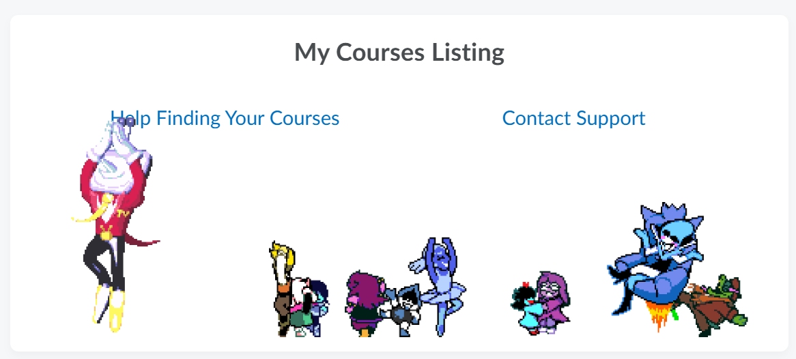

# MyCourses DeltaSpin

The world revolves around you. Spin, spin masterfully!

Adds spinning Deltarune characters to RIT's MyCourses homepage.

## Running from source

### Chrome

1. Clone this repository
1. Go to [chrome://extensions/](chrome://extensions/)
1. **MAKE SURE YOU ARE IN DEVELOPER MODE**
1. Click "Load Unpacked"
1. Select the cloned repository

### Firefox

1. Clone this repository
1. Go to [about:debugging](about:debugging)
1. Click "Load Temporary Add-on..."
1. Select the manifest.json file in the cloned repository
